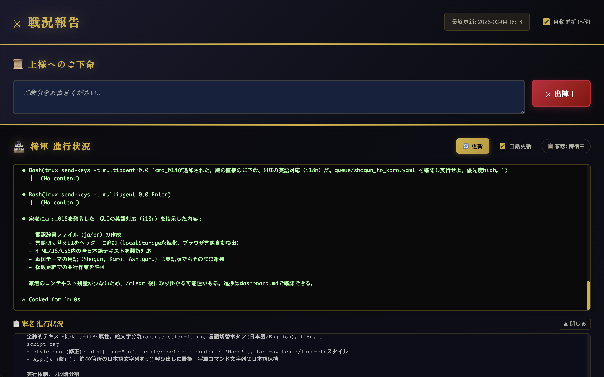

<div align="center">

# multi-agent-shogun-gui

**Web dashboard for [multi-agent-shogun](https://github.com/yohey-w/multi-agent-shogun) — monitor and command your AI army from the browser.**

[](https://opensource.org/licenses/MIT)
[](https://code.claude.com)
[]()

[English](README.md) | [日本語](README_ja.md)

</div>

---

A real-time web GUI that sits on top of [multi-agent-shogun](https://github.com/yohey-w/multi-agent-shogun). Give orders, watch your agents work, and review results — all from a single browser tab.

<p align="center">
  
</p>

*Live dashboard showing Shogun status, in-progress tasks, and Ashigaru workers — monitor your entire AI workforce from one screen.*

## Features

- **Live dashboard** — Parses `dashboard.md` and displays action items, in-progress tasks, completed work, and skill candidates in a clean UI (auto-refreshes every 5 seconds)
- **Command input** — Send instructions to the Shogun directly from the browser (`Cmd+Enter` / `Ctrl+Enter`)
- **Shogun terminal** — See the Shogun's live output without attaching to tmux
- **Ashigaru monitor** — Click any worker in the progress table to view their real-time pane output in a modal
- **Skill candidate viewer** — Browse proposed skills in a popup card layout

## Architecture

```
multi-agent-shogun-gui/
├── app.py                     # FastAPI server
├── parser.py                  # dashboard.md → JSON parser
├── setup_gui.sh               # First-time setup (CLI + GUI)
├── start_gui.sh               # Start GUI + agents
├── stop_gui.sh                # Stop GUI (+ agents optionally)
├── requirements.txt           # Python dependencies (FastAPI, uvicorn)
│
├── static/
│   ├── index.html             # Dashboard SPA
│   ├── style.css
│   └── app.js
│
├── shogun/                    # ← git subtree of multi-agent-shogun
│   ├── CLAUDE.md
│   ├── instructions/
│   ├── shutsujin_departure.sh
│   ├── first_setup.sh
│   └── ...
│
└── symlinks (created by setup)
    ├── config → shogun/config
    ├── queue → shogun/queue
    ├── dashboard.md → shogun/dashboard.md
    └── ...
```

The GUI reads `dashboard.md` and tmux pane output via the FastAPI backend. The CLI agent system (`shogun/`) runs independently in tmux — the GUI is a read/command layer on top.

## Prerequisites

- **macOS or Linux** (WSL2 on Windows)
- **Python 3.8+**
- **tmux**
- **Claude Code CLI** (`claude`)
- **Node.js** (for MCP servers)

## Quick Start

```bash
# 1. Clone
git clone https://github.com/torumitsutake/multi-agent-shogun-gui.git
cd multi-agent-shogun-gui

# 2. First-time setup (installs CLI dependencies + GUI dependencies)
chmod +x setup_gui.sh start_gui.sh stop_gui.sh
./setup_gui.sh

# 3. Launch (agents + GUI)
./start_gui.sh

# 4. Open in browser
open http://127.0.0.1:1059
```

## Usage

### Starting

```bash
./start_gui.sh                # Start agents + GUI (default)
./start_gui.sh -p 8080        # Custom port
./start_gui.sh --no-agent     # GUI only (agents already running)
./start_gui.sh --dev           # Development mode (hot reload)
./start_gui.sh -c              # Clean start (reset agents)
```

### Stopping

```bash
./stop_gui.sh                  # Stop GUI only
./stop_gui.sh -a               # Stop GUI + all agents (tmux sessions)
./stop_gui.sh -f               # Force stop (SIGKILL)
```

### tmux sessions

The agent system runs in two tmux sessions:

| Session | Content | Attach |
|---------|---------|--------|
| `shogun` | Shogun (general) | `tmux attach -t shogun` |
| `multiagent` | Karo (pane 0) + Ashigaru 1-8 (panes 1-8) | `tmux attach -t multiagent` |

### Convenient aliases (added by setup)

```bash
css   # Attach to Shogun session
csm   # Attach to multiagent session
csg   # Start GUI dashboard
```

## Updating the Shogun Core

The `shogun/` directory is managed as a [git subtree](https://www.atlassian.com/git/tutorials/git-subtree) from [yohey-w/multi-agent-shogun](https://github.com/yohey-w/multi-agent-shogun).

```bash
# Add upstream remote (first time only)
git remote add upstream git@github.com:yohey-w/multi-agent-shogun.git

# Pull latest changes
git fetch upstream
git subtree pull --prefix=shogun upstream main --squash
```

## API Endpoints

| Method | Endpoint | Description |
|--------|----------|-------------|
| `GET` | `/` | Dashboard HTML |
| `GET` | `/api/dashboard` | Parsed dashboard data (JSON) |
| `GET` | `/api/pane/shogun` | Shogun pane output |
| `GET` | `/api/ashigaru/{ashigaru_id}/output` | Ashigaru pane output |
| `POST` | `/api/command` | Send command to Shogun |

## Troubleshooting

<details>
<summary><b>GUI won't start?</b></summary>

Check that dependencies are installed:
```bash
pip3 install -r requirements.txt
```

Check if another instance is running:
```bash
./stop_gui.sh
./start_gui.sh
```

</details>

<details>
<summary><b>Dashboard shows no data?</b></summary>

Ensure agents are running and `dashboard.md` exists:
```bash
ls -la dashboard.md           # Should be a symlink to shogun/dashboard.md
tmux has-session -t shogun    # Should return 0
```

</details>

<details>
<summary><b>Ashigaru output not showing?</b></summary>

The GUI reads tmux pane output via `tmux capture-pane`. Make sure the multiagent session is running:
```bash
tmux has-session -t multiagent
```

</details>

For CLI-related issues, see the [multi-agent-shogun troubleshooting guide](https://github.com/yohey-w/multi-agent-shogun#troubleshooting).

## Credits

This project is built on top of [multi-agent-shogun](https://github.com/yohey-w/multi-agent-shogun) by [yohey-w](https://github.com/yohey-w) — a powerful multi-agent parallel development framework using Claude Code and tmux. The entire CLI-based agent hierarchy (Shogun → Karo → Ashigaru) that powers this GUI comes from multi-agent-shogun. We are deeply grateful for this exceptional foundation.

If you find this project useful, please consider starring the original repository: [⭐ multi-agent-shogun](https://github.com/yohey-w/multi-agent-shogun)

- Original concept: [Claude-Code-Communication](https://github.com/Akira-Papa/Claude-Code-Communication) by Akira-Papa

## License

[MIT](LICENSE)
